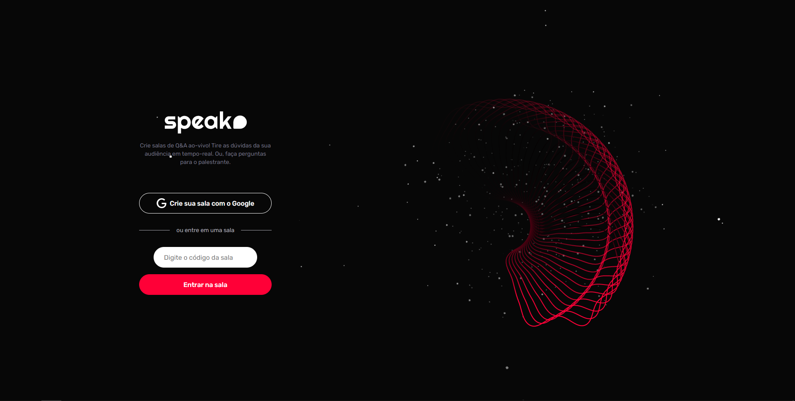

## Recriation of #letmeask from Rocketseat, made by me.

## Project view

<p align="center">

</p>

### Built with 🛠

- [React](https://reactjs.org/)
- [TypeScript](https://www.typescriptlang.org/)

### If you want to, clone the repo

```sh
git clone https://github.com/lucastso/react-letmeask-nlw
```

### Usage 👁

Interact with viewers if you are the host. If you are a user, send questions and interact with the host.
